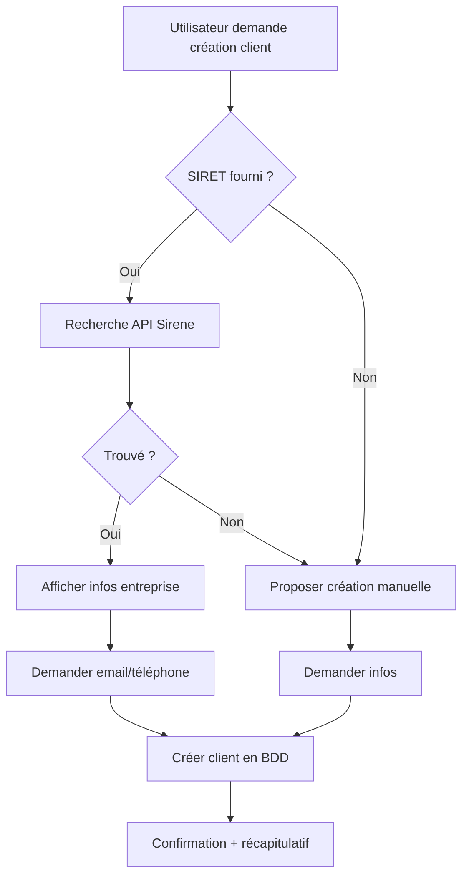

# 👥 Clara - Gestion de Clients via SIRET

## 🎯 Nouvelles Fonctionnalités

Clara peut maintenant **créer des clients automatiquement** en utilisant leur numéro SIRET !

### ✨ Ce qui change

1. **Recherche automatique via API Sirene** 🔍
   - Clara interroge l'API publique Sirene (gouvernement français)
   - Récupère automatiquement : raison sociale, SIRET, SIREN, adresse complète
   - Pré-remplit toutes les informations entreprise

2. **Demande des infos complémentaires** 📧
   - Email du contact (facultatif mais recommandé)
   - Téléphone (facultatif mais recommandé)
   - Notes personnalisées

3. **Création intelligente de factures/devis** 💼
   - Recherche automatique du client par nom/email/SIRET
   - Si le client n'existe pas : propose de le créer
   - Pré-remplit les données client dans les documents

---

## 📝 Exemples d'utilisation

### 1. Créer un client avec SIRET

**Vous :**
```
Crée un client avec le SIRET 83200738000015
```

**Clara :**
```
Parfait Mahdi ! Je recherche ce SIRET dans la base Sirene... 🔍

✅ J'ai trouvé l'entreprise "OPENAI FRANCE" !

📋 Informations récupérées:
- Raison sociale: OPENAI FRANCE
- SIRET: 832 007 380 00015
- SIREN: 832007380
- Adresse: 15 Avenue Montaigne, 75008 Paris

Pour finaliser la création, j'ai besoin de:
📧 Email du contact ?
📞 Téléphone ?

(Ces infos sont facultatives mais recommandées pour envoyer factures/devis)
```

**Vous :**
```
contact@openai.fr et 01 23 45 67 89
```

**Clara :**
```
✅ Client "OPENAI FRANCE" créé avec succès ! 🎉

📋 Récapitulatif:
- Entreprise: OPENAI FRANCE
- SIRET: 832 007 380 00015
- Adresse: 15 Avenue Montaigne, 75008 Paris
- Email: contact@openai.fr
- Téléphone: 01 23 45 67 89

Je peux maintenant créer des factures ou devis pour ce client ! 💼
```

---

### 2. Créer une facture pour un client

**Vous :**
```
Crée une facture pour OPENAI FRANCE
```

**Clara :**
```
Parfait Mahdi ! J'ai trouvé le client "OPENAI FRANCE". 

Pour créer la facture, j'ai besoin de:
💰 Montant TTC ?
📝 Description/Objet de la facture ?
📅 Date (aujourd'hui par défaut) ?
```

**Vous :**
```
1500€, Mission de convoyage Paris-Lyon, aujourd'hui
```

**Clara :**
```
✅ Facture créée avec succès pour OPENAI FRANCE ! 💼

📋 Détails:
- Client: OPENAI FRANCE (SIRET: 832 007 380 00015)
- Montant: 1500€ TTC
- Objet: Mission de convoyage Paris-Lyon
- Date: 12/10/2025

📎 [Télécharger la facture PDF]
📧 Veux-tu que je l'envoie par email à contact@openai.fr ?
```

---

### 3. Rechercher un client

**Vous :**
```
Recherche le client OPENAI
```

**Clara :**
```
✅ Client trouvé !

📋 OPENAI FRANCE
🏢 OPENAI FRANCE
📄 SIRET: 832 007 380 00015
📧 contact@openai.fr
📞 01 23 45 67 89
📍 15 Avenue Montaigne, 75008 Paris

Veux-tu créer une facture ou un devis pour ce client ?
```

---

### 4. Lister tous les clients

**Vous :**
```
Liste mes clients
```

**Clara :**
```
📋 Voici tes 3 client(s):

1. OPENAI FRANCE (OPENAI FRANCE)
   SIRET: 832 007 380 00015 | contact@openai.fr

2. ACME TRANSPORT (ACME TRANSPORT SARL)
   SIRET: 123 456 789 00014 | acme@transport.fr

3. AUTO FRANCE (AUTO FRANCE SAS)
   SIRET: 987 654 321 00023 | contact@autofrance.fr
```

---

### 5. Client introuvable avec SIRET

**Vous :**
```
Crée un client avec le SIRET 99999999999999
```

**Clara :**
```
❌ SIRET 99999999999999 non trouvé dans la base INSEE. 

Veux-tu créer le client manuellement ?

Si oui, donne-moi:
- Nom de l'entreprise
- Adresse
- Email (facultatif)
- Téléphone (facultatif)
```

**Vous :**
```
Oui, Transport Express, 10 Rue de Paris 69001 Lyon, transport@express.fr, 04 12 34 56 78
```

**Clara :**
```
✅ Client "Transport Express" créé avec succès ! 🎉

Je peux maintenant créer des factures ou devis pour ce client ! 💼
```

---

## 🔧 Fonctionnalités techniques

### Services créés

#### `clientCreationService.ts`

```typescript
// Créer un client via SIRET
createClientFromSiret(userId, siret, additionalData)

// Créer un client manuellement
createClientManually(userId, clientData)

// Rechercher un client
findClient(userId, query) // Par nom, email ou SIRET

// Lister tous les clients
listClients(userId)
```

### Actions AI disponibles

1. **`create_client`**
   - Données: `{ siret?, name, email?, phone?, address?, notes? }`
   - Crée un client via SIRET ou manuellement

2. **`search_client`**
   - Données: `{ query: string }`
   - Recherche un client existant

3. **`list_clients`**
   - Pas de données requises
   - Liste tous les clients de l'utilisateur

---

## 📊 Workflow complet



---

## 🧪 Tests recommandés

### 1. SIRET valide existant

```bash
# SIRET de Google France
Crée un client avec le SIRET 44306184100047
```

**Résultat attendu :** ✅ Données Google France pré-remplies

### 2. SIRET invalide

```bash
Crée un client avec le SIRET 99999999999999
```

**Résultat attendu :** ❌ Proposition de création manuelle

### 3. Facture pour client existant

```bash
# Après avoir créé Google France
Crée une facture pour Google France
```

**Résultat attendu :** ✅ Client trouvé, demande montant/description

### 4. Facture pour client inexistant

```bash
Crée une facture pour Microsoft
```

**Résultat attendu :** ❌ "Client non trouvé, veux-tu le créer ?"

### 5. Recherche client

```bash
Recherche Google
```

**Résultat attendu :** ✅ Affichage des infos complètes

---

## 🎨 Format des réponses Clara

### Création client réussie

```
✅ Client "[Nom]" créé avec succès ! 🎉

📋 Récapitulatif:
- Entreprise: [Raison sociale]
- SIRET: [XXX XXX XXX XXXXX]
- Adresse: [Adresse complète]
- Email: [email ou "Non renseigné"]
- Téléphone: [téléphone ou "Non renseigné"]

Je peux maintenant créer des factures ou devis pour ce client ! 💼
```

### SIRET trouvé, attente infos

```
✅ J'ai trouvé l'entreprise "[Nom]" !

📋 Informations récupérées:
- Raison sociale: [Nom]
- SIRET: [XXX XXX XXX XXXXX]
- SIREN: [XXX XXX XXX]
- Adresse: [Adresse]

Pour finaliser la création, j'ai besoin de:
📧 Email du contact ?
📞 Téléphone ?

(Ces infos sont facultatives mais recommandées pour envoyer factures/devis)
```

### Client non trouvé

```
❌ Aucun client trouvé pour "[Recherche]".

Veux-tu que je crée ce client ? Si oui, donne-moi son SIRET ou ses informations.
```

---

## 🔐 Sécurité

- ✅ **RLS activé** : Chaque utilisateur ne voit que ses propres clients
- ✅ **Validation SIRET** : Format 14 chiffres vérifié
- ✅ **API publique** : Recherche Entreprises API (data.gouv.fr)
- ✅ **Données réelles** : Informations vérifiées INSEE

---

## 📚 Prochaines améliorations possibles

1. **Historique client** 📈
   - Afficher nombre de factures
   - Montant total généré
   - Dernière facture

2. **Export clients** 📊
   - Export CSV
   - Export Excel

3. **Fusion de clients** 🔗
   - Détecter doublons
   - Fusionner 2 clients

4. **Notes et tags** 🏷️
   - Ajouter des notes personnalisées
   - Catégoriser les clients

---

## 🚀 Déploiement

### Prérequis

1. Migration SQL `20251009110444_add_clients_table.sql` appliquée
2. Table `clients` créée dans Supabase
3. RLS activé sur la table

### Fichiers modifiés

```
✅ src/services/clientCreationService.ts (CRÉÉ)
✅ src/services/aiServiceEnhanced.ts (MODIFIÉ)
✅ src/components/ChatAssistant.tsx (MODIFIÉ)
```

### Dépendances

- `inseeService.ts` : Recherche API Sirene
- `supabase` : Base de données clients

---

## 💡 Conseils d'utilisation

### Pour les utilisateurs

1. **Toujours fournir le SIRET** si disponible
   - Gain de temps énorme
   - Données certifiées INSEE
   - Pas d'erreur de saisie

2. **Ajouter email et téléphone**
   - Permet l'envoi automatique de factures
   - Améliore le suivi client

3. **Vérifier les doublons**
   - Rechercher avant de créer
   - Utiliser "Liste mes clients"

### Pour les développeurs

1. **API Sirene publique**
   - Pas de clé API requise
   - Gratuit et illimité
   - Données officielles

2. **Gestion d'erreurs**
   - SIRET invalide géré
   - API indisponible géré
   - Doublons détectés

3. **Performance**
   - Cache possible (à implémenter)
   - Index sur SIRET dans BDD

---

## 📞 Support

En cas de problème :

1. Vérifier que le SIRET est valide (14 chiffres)
2. Tester sur [recherche-entreprises.api.gouv.fr](https://recherche-entreprises.api.gouv.fr)
3. Vérifier la console navigateur (F12)
4. Logs détaillés dans `clientCreationService.ts`

---

**Créé le :** 12 octobre 2025  
**Version :** 1.0  
**Clara version :** Enhanced with Client Management 🎉
