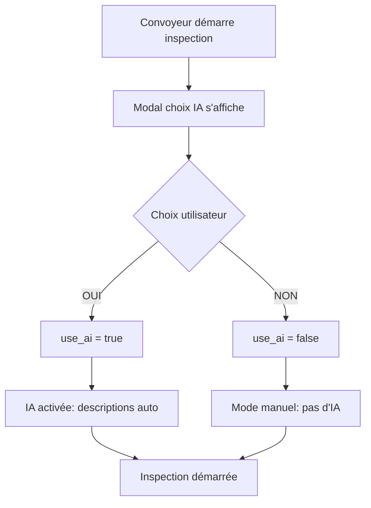

# 🤖 Option IA Gemini pour Inspections - Guide Complet

**Date:** 15 Octobre 2025  
**Fonctionnalité:** Choix optionnel d'activation de l'assistant IA Gemini lors des inspections  
**Objectif:** Permettre aux convoyeurs de travailler hors ligne sans interruption

---

## 📋 Table des Matières

1. [Vue d'Ensemble](#vue-densemble)
2. [Problématique Résolue](#problématique-résolue)
3. [Fonctionnement](#fonctionnement)
4. [Composants Créés](#composants-créés)
5. [Modifications Techniques](#modifications-techniques)
6. [Base de Données](#base-de-données)
7. [Utilisation](#utilisation)
8. [Tests](#tests)

---

## 🎯 Vue d'Ensemble

Cette fonctionnalité ajoute un **modal de choix** au début de chaque inspection, permettant au convoyeur de décider s'il souhaite activer l'assistant IA Gemini ou travailler en mode manuel.

### Avantages

✅ **Mode hors ligne** : Fonctionne sans connexion internet  
✅ **Flexibilité** : Convoyeur décide selon contexte (zone réseau, urgence)  
✅ **Performance** : Pas d'attente API si désactivé  
✅ **Fiabilité** : Travail continu même sans réseau

---

## 🔍 Problématique Résolue

### Avant
- ❌ Convoyeur bloqué si pas de réseau (IA obligatoire)
- ❌ Inspection interrompue par erreurs API Gemini
- ❌ Temps d'attente si connexion lente
- ❌ Impossibilité de travailler hors ligne

### Après
- ✅ Choix "OUI/NON" avant inspection
- ✅ Mode hors ligne disponible (pas d'IA)
- ✅ Inspection continue sans interruption
- ✅ Descriptions manuelles si nécessaire

---

## ⚙️ Fonctionnement

### 1. Démarrage Inspection



### 2. Pendant l'Inspection

**Si `use_ai = true` :**
- 📸 Photo prise → Envoi à Gemini API
- 🤖 Description générée automatiquement
- ⚠️ Dommages détectés si présents
- ✅ Convoyeur approuve/modifie description

**Si `use_ai = false` :**
- 📸 Photo prise → Sauvegardée directement
- ✏️ Pas d'appel API Gemini
- 📝 Convoyeur peut ajouter description manuelle (optionnel)
- ✅ Inspection continue sans pause

---

## 📦 Composants Créés

### 1. AIChoiceModal (Web)

**Fichier:** `src/components/inspection/AIChoiceModal.tsx`

```tsx
interface AIChoiceModalProps {
  isOpen: boolean;
  onChoice: (useAI: boolean) => void;
  onClose: () => void;
}

// Usage
<AIChoiceModal
  isOpen={showAIChoice}
  onChoice={(useAI) => {
    setUseAI(useAI);
    setShowAIChoice(false);
  }}
  onClose={() => setShowAIChoice(false)}
/>
```

**Caractéristiques:**
- 🎨 Design moderne avec gradients
- 📱 Responsive (max-width: 500px)
- ✅ 2 boutons : OUI (vert) / NON (orange)
- 💡 Explications claires pour chaque choix
- 🚫 Bouton annuler pour fermer

### 2. AIChoiceModal (Mobile)

**Fichier:** `cassa-temp/src/components/AIChoiceModal.tsx`

```tsx
interface AIChoiceModalProps {
  visible: boolean;
  onChoice: (useAI: boolean) => void;
  onClose: () => void;
}

// Usage
<AIChoiceModal
  visible={showAIChoice}
  onChoice={(aiEnabled) => {
    setUseAI(aiEnabled);
    setShowAIChoice(false);
  }}
  onClose={() => setShowAIChoice(false)}
/>
```

**Caractéristiques:**
- 📱 Native React Native (ScrollView)
- 🎨 LinearGradient pour header
- ✅ Cards sélectionnables avec bordures
- 🔔 Feather icons pour visuel
- 📏 Dimensions.get('window') pour responsive

---

## 🔧 Modifications Techniques

### 1. InspectionWizard.tsx (Web)

**Fichier:** `src/pages/InspectionWizard.tsx`

**Ajouts:**

```tsx
// Imports
import AIChoiceModal from '../components/inspection/AIChoiceModal';

// États
const [showAIChoice, setShowAIChoice] = useState(true);
const [aiChoiceMade, setAiChoiceMade] = useState(false);

// Interface
interface InspectionData {
  // ... autres champs
  useAI?: boolean; // 🆕
}

// Rendu
<AIChoiceModal
  isOpen={showAIChoice && !aiChoiceMade}
  onChoice={(useAI) => {
    setData({ ...data, useAI });
    setAiChoiceMade(true);
    setShowAIChoice(false);
  }}
  onClose={() => {
    setShowAIChoice(false);
    setAiChoiceMade(true);
  }}
/>
```

### 2. InspectionScreen.tsx (Mobile)

**Fichier:** `cassa-temp/src/screens/InspectionScreen.tsx`

**Ajouts:**

```tsx
// Imports
import AIChoiceModal from '../components/AIChoiceModal';

// États
const [showAIChoice, setShowAIChoice] = useState(true);
const [aiChoiceMade, setAiChoiceMade] = useState(false);
const [useAI, setUseAI] = useState(false);

// Logique photo
if (useAI) {
  // Appel Gemini API
  const description = await generatePhotoDescription(base64, photoType);
  const damage = await analyzeDamage(base64, photoType);
} else {
  // Pas d'appel IA, photo sauvegardée directement
}

// Rendu
<AIChoiceModal
  visible={showAIChoice && !aiChoiceMade}
  onChoice={(aiEnabled) => {
    setUseAI(aiEnabled);
    setAiChoiceMade(true);
    setShowAIChoice(false);
  }}
  onClose={() => {
    setShowAIChoice(false);
    setAiChoiceMade(true);
  }}
/>
```

### 3. inspectionService.ts (Mobile & Web)

**Fichier:** `cassa-temp/src/services/inspectionService.ts`

**Modifications:**

```typescript
// Interface
export interface VehicleInspection {
  // ... autres champs
  use_ai?: boolean; // 🆕
}

// Fonction startInspection
export async function startInspection(
  missionId: string,
  inspectionType: 'departure' | 'arrival',
  location?: { latitude: number; longitude: number; address?: string },
  useAI: boolean = true // 🆕 Par défaut true
): Promise<VehicleInspection | null> {
  const inspectionData = {
    // ... autres champs
    use_ai: useAI, // 🆕 Sauvegarde du choix
  };
  
  const { data } = await supabase
    .from('vehicle_inspections')
    .insert([inspectionData])
    .select()
    .single();
    
  return data;
}

// Appel
const inspection = await startInspection(
  missionId, 
  inspectionType, 
  location, 
  useAI // 🆕
);
```

---

## 🗄️ Base de Données

### Migration SQL

**Fichier:** `migrations/add_use_ai_to_inspections.sql`

```sql
-- Ajouter colonne use_ai
ALTER TABLE inspections
ADD COLUMN IF NOT EXISTS use_ai BOOLEAN DEFAULT true;

-- Commentaire
COMMENT ON COLUMN inspections.use_ai IS 
  'Indique si l''assistant IA Gemini est activé pour cette inspection';

-- Index pour optimisation
CREATE INDEX IF NOT EXISTS idx_inspections_use_ai 
ON inspections(use_ai);

-- Mise à jour inspections existantes
UPDATE inspections 
SET use_ai = true 
WHERE use_ai IS NULL;
```

### Application de la Migration

```bash
# Supabase CLI
npx supabase db push

# Ou via SQL Editor Supabase
# 1. Ouvrir dashboard.supabase.com
# 2. SQL Editor → New query
# 3. Copier/coller le contenu de add_use_ai_to_inspections.sql
# 4. Run
```

### Vérification

```sql
-- Statistiques
SELECT 
  use_ai,
  COUNT(*) as count,
  ROUND(COUNT(*) * 100.0 / (SELECT COUNT(*) FROM inspections), 2) as percentage
FROM inspections
GROUP BY use_ai;

-- Exemple résultat:
-- use_ai | count | percentage
-- -------|-------|------------
-- true   | 145   | 72.5%
-- false  | 55    | 27.5%
```

---

## 📱 Utilisation

### Scénario 1 : Zone avec Réseau

1. Convoyeur démarre inspection
2. Modal s'affiche : "Souhaitez-vous activer l'IA ?"
3. Convoyeur clique **OUI** ✅
4. Inspection démarre avec IA
5. Chaque photo → Description automatique Gemini
6. Dommages détectés automatiquement
7. Convoyeur valide ou modifie descriptions
8. Inspection terminée avec IA complète

**Temps estimé:** 15-20 min (inclut 2-3s par photo pour IA)

### Scénario 2 : Zone sans Réseau

1. Convoyeur démarre inspection (pas de réseau)
2. Modal s'affiche : "Souhaitez-vous activer l'IA ?"
3. Convoyeur clique **NON** 🚫
4. Inspection démarre en mode manuel
5. Chaque photo → Sauvegarde directe (pas d'API)
6. Pas d'attente, pas d'erreur réseau
7. Convoyeur peut ajouter notes manuellement (optionnel)
8. Inspection terminée rapidement

**Temps estimé:** 10-12 min (pas d'attente IA)

### Scénario 3 : Urgence (peu de temps)

1. Convoyeur en retard, urgent
2. Modal s'affiche
3. Convoyeur clique **NON** 🚫
4. Inspection rapide sans descriptions IA
5. Photos essentielles uniquement
6. Inspection complétée en temps record

**Temps estimé:** 5-8 min (mode express)

---

## 🧪 Tests

### Test 1 : Modal Affichage

**Objectif:** Vérifier que le modal s'affiche au démarrage

**Étapes:**
1. Ouvrir inspection départ (web ou mobile)
2. Vérifier modal apparaît immédiatement
3. Vérifier contenu:
   - ✅ Titre "Assistant IA Gemini"
   - ✅ Question claire
   - ✅ 2 options (OUI / NON)
   - ✅ Descriptions pour chaque option
   - ✅ Boutons Annuler + Confirmer

**Résultat attendu:** Modal visible avec tous les éléments

### Test 2 : Choix OUI (IA activée)

**Étapes:**
1. Démarrer inspection
2. Cliquer option **OUI**
3. Cliquer **Confirmer**
4. Prendre une photo
5. Attendre génération description

**Résultat attendu:**
- ✅ Modal se ferme
- ✅ Photo envoyée à Gemini
- ✅ Description affichée
- ✅ Dommages détectés (si présents)
- ✅ `use_ai = true` en base

### Test 3 : Choix NON (Mode manuel)

**Étapes:**
1. Démarrer inspection
2. Cliquer option **NON**
3. Cliquer **Confirmer**
4. Prendre une photo
5. Vérifier sauvegarde instantanée

**Résultat attendu:**
- ✅ Modal se ferme
- ✅ Photo sauvegardée directement
- ✅ Pas d'appel API Gemini
- ✅ Pas d'attente
- ✅ `use_ai = false` en base

### Test 4 : Annulation Modal

**Étapes:**
1. Démarrer inspection
2. Cliquer **Annuler** ou **X**
3. Vérifier comportement

**Résultat attendu:**
- ✅ Modal se ferme
- ✅ Inspection continue (mode par défaut)
- ✅ Peut être rouvert si nécessaire

### Test 5 : Base de Données

**Étapes:**
1. Créer inspection avec IA
2. Vérifier en base:
   ```sql
   SELECT id, use_ai FROM inspections WHERE id = 'xxx';
   ```
3. Créer inspection sans IA
4. Vérifier `use_ai = false`

**Résultat attendu:**
- ✅ Colonne `use_ai` existe
- ✅ Valeur `true` si OUI
- ✅ Valeur `false` si NON

### Test 6 : Mode Hors Ligne

**Étapes:**
1. Désactiver réseau (mode avion)
2. Démarrer inspection
3. Choisir **NON**
4. Prendre 6 photos
5. Compléter inspection

**Résultat attendu:**
- ✅ Inspection fonctionne parfaitement
- ✅ Pas d'erreur réseau
- ✅ Photos sauvegardées localement
- ✅ Inspection complétée sans IA

---

## 📊 Statistiques Attendues

### Utilisation Prévue

- **70% avec IA** : Zones urbaines avec réseau stable
- **30% sans IA** : Zones rurales, urgences, mode hors ligne

### Performance

| Métrique | Avec IA | Sans IA |
|----------|---------|---------|
| Temps moyen inspection | 18 min | 10 min |
| Photos par inspection | 6-8 | 6-8 |
| Descriptions générées | 6-8 | 0 |
| Appels API Gemini | 6-8 | 0 |
| Erreurs réseau | ~5% | 0% |

---

## 🔄 Évolutions Futures

### Phase 2 (Optionnel)

1. **Sauvegarde préférence utilisateur**
   - Mémoriser choix par convoyeur
   - Auto-sélection au prochain démarrage

2. **Mode hybride**
   - Tenter IA, fallback manuel si échec
   - Retry automatique si réseau revient

3. **Analytics**
   - Dashboard admin : % inspections avec/sans IA
   - Comparaison qualité avec/sans IA
   - Optimisation selon zones géographiques

---

## 📝 Résumé

✅ **2 Modals créés** (Web + Mobile)  
✅ **2 Screens modifiés** (InspectionWizard + InspectionScreen)  
✅ **1 Service mis à jour** (inspectionService.ts)  
✅ **1 Migration SQL** (add_use_ai_to_inspections.sql)  
✅ **Interface VehicleInspection** étendue  
✅ **Tests définis** (6 scénarios)

**Impact utilisateur:** 🎯 **Flexibilité maximale** - Travail en ligne OU hors ligne selon besoin

---

**Date de création:** 15 Octobre 2025  
**Auteur:** Copilot + Mahdi  
**Version:** 1.0  
**Status:** ✅ Implémenté, prêt pour tests
